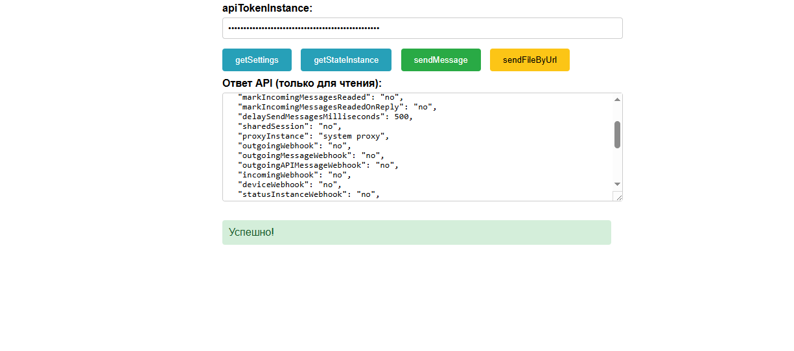
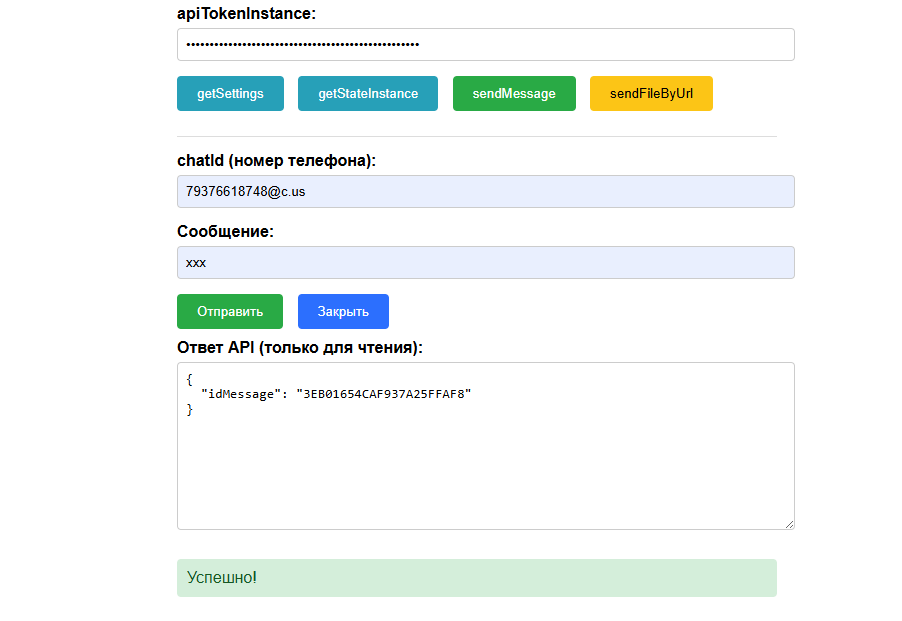

# 🟢 GREEN-API Test Panel

Тестовое задание на позицию **DevOps разработчик**.

HTML-страница для работы с методами **GREEN-API** (WhatsApp API) с использованием **Node.js serverless функций** и деплоем на **Vercel**.

## 📋 Требования из задания

- ✅ Методы: `getSettings`, `getStateInstance`, `sendMessage`, `sendFileByUrl`
- ✅ Поля для ввода `idInstance` и `apiTokenInstance`
- ✅ Вывод ответа в отдельное поле (только для чтения)
- ✅ Соответствие макету

## 🏗 Архитектура проекта

```
green-api-test/
├── public/
│   └── index.html          # HTML-страница с UI
├── api/
│   └── green-api.js        # Serverless функция (Node.js)
├── package.json            # Зависимости
└── README.md               # Этот файл
```

### Как это работает

```
┌─────────────┐     POST /api/green-api     ┌─────────────────────┐
│   БРАУЗЕР   │ ───────────────────────────▶│  Vercel Serverless  │
│  (HTML UI)  │                             │   (Node.js функция) │
└─────────────┘                             └──────────┬──────────┘
                                                       │
                                                       │ POST waInstance{id}/{method}/{token}
                                                       ▼
                                              ┌─────────────────────┐
                                              │   GREEN-API Server  │
                                              │  (api.green-api.com)│
                                              └──────────┬──────────┘
                                                         │
                                                         │ WhatsApp
                                                         ▼
                                                ┌─────────────────┐
                                                │   WhatsApp API  │
                                                └─────────────────┘
```

## 🚀 Быстрый старт

### 1. Установка зависимостей

```bash
cd green-api-test
npm install
```

### 2. Локальная разработка (опционально)

```bash
# Запуск локального сервера Vercel
npm run dev
```

Откройте http://localhost:3000

### 3. Деплой на Vercel

#### Вариант A: Через Vercel CLI (рекомендуется)

```bash
# Установите Vercel CLI глобально (если нет)
npm install -g vercel

# Войдите в аккаунт
vercel login

# Задеплойте
vercel --prod
```

#### Вариант B: Через GitHub + Vercel (автоматический деплой)

1. **Создайте репозиторий на GitHub:**
   ```bash
   git init
   git add .
   git commit -m "Initial commit: GREEN-API test panel"
   git branch -M main
   git remote add origin https://github.com/ВАШ_НИК/green-api-test.git
   git push -u origin main
   ```

2. **Подключите репозиторий к Vercel:**
   - Зайдите на https://vercel.com
   - Нажмите **"Add New Project"**
   - Выберите **"Import Git Repository"**
   - Выберите ваш репозиторий `green-api-test`
   - Нажмите **"Deploy"**

3. **Готово!** Vercel выдаст ссылку вида:
   ```
   https://green-api-test-xxx.vercel.app
   ```

## 📱 Как использовать

### 1. Подготовка GREEN-API

1. Зайдите в личный кабинет https://green-api.com
2. Создайте новый инстанс на бесплатном тарифе
3. Скопируйте `idInstance` и `apiTokenInstance`
4. Отсканируйте QR-код своим WhatsApp

### 2. Работа с панелью

1. Откройте опубликованную страницу
2. Введите `idInstance` и `apiTokenInstance`
3. Нажмите одну из кнопок:
   - **⚙️ getSettings** — получить настройки инстанса
   - **📊 getStateInstance** — проверить состояние
   - **💬 sendMessage** — отправить сообщение
   - **📎 sendFileByUrl** — отправить файл по URL

4. Результат отобразится в поле **"Ответ от API"**

### 3. Проверка работы

**getSettings** должен вернуть:
```json
{
  "countryInstance": "ru",
  "typeAccount": "trial",
  ...
}
```

**getStateInstance** должен вернуть:
```json
{
  "stateInstance": "authorized"
}
```

**sendMessage** должен вернуть:
```json
{
  "idMessage": "BAE5..."
}
```

## 🔧 Технические детали

### Настройка

Скопируйте `.env.example` в `.env` и добавьте ваши данные (опционально):

```bash
cp .env.example .env
```

### API Endpoint

**URL:** `POST /api/green-api`

**Тело запроса:**
```json
{
  "method": "getSettings",
  "idInstance": "1101234567",
  "apiTokenInstance": "abc123xyz"
}
```

**Для sendMessage:**
```json
{
  "method": "sendMessage",
  "idInstance": "1101234567",
  "apiTokenInstance": "abc123xyz",
  "chatId": "79991234567@c.us",
  "message": "Привет!"
}
```

**Для sendFileByUrl:**
```json
{
  "method": "sendFileByUrl",
  "idInstance": "1101234567",
  "apiTokenInstance": "abc123xyz",
  "chatId": "79991234567@c.us",
  "fileUrl": "https://example.com/file.pdf",
  "fileName": "document.pdf",
  "caption": "Описание файла"
}
```

### Почему serverless функция?

| Причина | Объяснение |
|---------|------------|
| **Безопасность** | Токены не передаются в браузере напрямую к GREEN-API |
| **CORS** | Нет проблем с cross-origin запросами |
| **Логирование** | Можно смотреть логи в дашборде Vercel |
| **Расширяемость** | Легко добавить middleware, кэш,.rate limiting |

## 📁 Структура файлов

### `public/index.html`
- HTML разметка формы
- CSS стили (адаптивный дизайн)
- JavaScript логика (вызов API, localStorage)

### `api/green-api.js`
- Serverless функция на Node.js
- Обработка запросов к GREEN-API
- Валидация параметров
- Обработка ошибок

## 🔗 Ссылки

- [GREEN-API документация](https://green-api.com/docs/)
- [Vercel документация](https://vercel.com/docs)
- [Serverless Functions](https://vercel.com/docs/functions)

## 📝 Результат выполнения задания

Для отправки на hr@green-api.com:

1. ✅ **Резюме** — приложить PDF
2. ✅ **Telegram** — ссылка на профиль
3. ✅ **GitHub** — https://github.com/ВАШ_НИК/green-api-test
4. ✅ **HTML страница** — https://green-api-test-xxx.vercel.app
5. ✅ **Скриншоты/видео** — (по желанию)

---

## 📸 Скриншоты

### getSettings — ответ API



### sendMessage — отправка сообщения



---

**Автор:** [Ваше имя]
**Дата:** 2026
